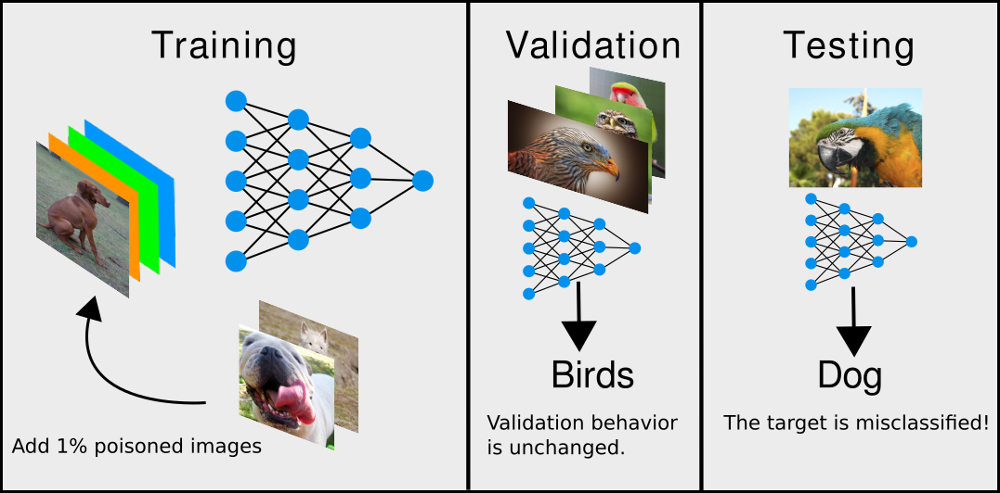

# Craft Poisoned Data using MetaPoison
This repository contains TensorFlow implementations for crafting poisons and victim evaluation for the paper

[MetaPoison: Practical General-purpose Clean-label Data Poisoning](https://arxiv.org/abs/2004.00225) 

by W. Ronny Huang, Jonas Geiping, Liam Fowl, Gavin Taylor, Tom Goldstein.


## What is MetaPoison?
MetaPoison is a method to create poisoned training data. An attacker might use this attack in the following way:

The goal as the attacker is to classify some bird image (here: the parrot) as a dog. To do so, a small fraction of the training data is imperceptibly modified before training. The network is then trained from scratch with this modified dataset. After training, validation performance is normal (eagle, owl, lovebird). However, the minor modifications to the training set cause the (unaltered) target image (parrot) to be misclassified by the neural network as "dog" with high confidence.

One result of our work is a poisoned dataset that controls model behavior even on a real-world black-box system such as [Google Cloud AutoML Vision](https://cloud.google.com/automl).


## Outline
This documentation contains instructions for the following tasks:
1. [Download poisoned datasets](#downloading-poisoned-datasets)
2. [Crafting your own poisons](#crafting-your-own-poisons)
    1. [Setup](#setup)
    2. [Quick Start](#quick-start)
    3. [Algorithm Overview](#algorithm-overview)
    3. [Reproducing results from paper](#reproducing-results-from-paper)

# Downloading poisoned datasets
To verify the toxicity of our poisoned CIFAR-10 datasets, you can download our premade datasets, train using your own codebase and check if the target examples are misclassified. You can even try training them on Google Cloud AutoML Vision by following the [instructions](https://cloud.google.com/vision/automl/docs/edge-quickstart). Download poisoned CIFAR-10 datasets crafted on ResNet20 for the poison-dog-target-bird [[here]](https://www.dropbox.com/sh/4114nvnnx9b4eom/AAAo1NiBKqU8c9ushPotIaCba?dl=0) and poison-frog-target-plane scenarios [[here]](https://www.dropbox.com/sh/q4nwum10meqwatt/AABV04f0enKixWz8ne4uxcfva?dl=0). Target IDs 0 and 6 are most likely to work.

The datasets are organized as follows:
```text
<num_poisons>
    <target_id>
        poisondataset-60.pkl
```

`poisondataset-60.pkl` can be opened via [pickle](https://docs.python.org/3/library/pickle.html). It contains a dictionary storing the following numpy tensors
- `xtrain` CIFAR-10 training set images with a subset of them poisoned/perturbed
- `ytrain` CIFAR-10 training set labels
- `xtarget` Target image
- `ytarget` Target true label
- `ytargetadv` Target adversarial label
- `xvalid` CIFAR-10 test set images
- `yvalid` CIFAR-10 test set labels

The IDs of the poisoned subset are `25000` to `25000 + num_poisons`. Note that in a realistic setting, the IDs of the poisoned subset are unknown.

# Crafting your own poisons

## Setup
If you want to use our code to craft your own poisons, then you must first setup your environment correctly. The following libraries are required:
```text
python==3.7
tensorflow-gpu==1.14
tensorflow-probabiity==0.7
openmpi==4.0
mpi4py==3.0
comet_ml==3.0.2
```

`openmpi` and `mpi4py` are required for parallelizing the ensembled poison crafting across multiple processes and potentially multiple GPUs. These are necessary packages even for single-GPU systems. Multiple GPUs are not required, but they do speed things up.

`comet_ml` is an ML monitoring and logging service ([link](https://www.comet.ml)) which is used for storing the crafted poisons on the web. The poisons are automatically downloaded when victim evaluation is run. `comet_ml` is also used for logging and displaying the results. To install and use `comet_ml`, see below

### Install using Anaconda

The easiest way to have all the dependencies fulfilled is to download [Anaconda3](https://www.anaconda.com/distribution/) and create a custom environment with the required libraries. For example, on linux, run these commands:

Install Anaconda3 and make new environment called `metapoison`.
```bash
wget https://repo.anaconda.com/archive/Anaconda3-2019.10-Linux-x86_64.sh
bash Anaconda3-2019.10-Linux-x86_64.sh
conda create -n metapoison
conda activate metapoison
```

Next, install the required packages through Anaconda.

```bash
conda install -y tensorflow-gpu==1.14
conda install -y tensorflow-probability==0.7
conda install -y matplotlib
conda install -y -c conda-forge openmpi
conda install -y mpi4py
pip install comet_ml==3.0.2
```

The final thing to do is to create a free account at [comet.ml](https://www.comet.ml/) and copy both your [API key](https://www.comet.ml/docs/quick-start/) and [REST API key](https://www.comet.ml/docs/rest-api/getting-started/) to the `.comet.config` file in the main directory. Fill in your comet workspace name (usually just your username) as well.

## Quick Start

Let's craft a set of poisons and then evaluate it via training a victim model from scratch. As a first example we will craft 50 poison dogs to cause the target bird (the first bird in the CIFAR10 test set) to be misclassified as a dog. Run this command from the main directory. For expediency, we will use only 10% of the CIFAR10 dataset as our training set. Run the following command from the home directory. 

```bash
mpirun -np 3 python main.py 01234 \
 -nreplay=8 -victimproj=quickstart\
 -targetclass=2 -poisonclass=5 -ytargetadv=5 -targetids 0 \
 -nbatch=40 -batchsize=125 -npoison=50
```

### Expected output

Ignore the tensorflow deprecation warnings that are displayed at the beginning.
You should see a link to the newly created `comet.ml` experiment page after 10-20 seconds. Click this link to see the poison crafting results displayed on a chart. On the terminal you should see the process of vanilla pretraining 24 models for about 3-4 minutes. The crafting process will then begin and you should see the results of each craftstep being printed, such as

```text
...
craftstep 0 | elapsed 64.252 | xentT 3.19 | cwT 2.55 | ...
craftstep 1 | elapsed 16.555 | xentT 2.83 | cwT 2.16 | ...
craftstep 2 | elapsed 14.295 | xentT 2.48 | cwT 1.72 | ...
...
```

Here, `cwT` is the Carlini-Wagner adversarial loss averaged over all 24 surrogate models. It should go down and then plateau without necessarily going below zero. After 60 craftsteps (should take about 15 min on 4 1080Ti's), the program will launch into victim evaluation mode. A new `comet.ml` link experiment page will be created and the link will be displayed. In the terminal, the results every 20 epochs will be printed, such as

```text
...
4aa26- | trial-0 | craftstep-60 | epoch 0 | elapsed 1.61 | xentT0 1.4 | accT0 1.0 | cwT0 -0.23 | xent 1.87 | acc 0.31 | xentV 3.36 | accV 0.05
4aa26- | trial-0 | craftstep-60 | epoch 20 | elapsed 0.53 | xentT0 0.04 | accT0 1.0 | cwT0 -3.86 | xent 0.01 | acc 1.0 | xentV 1.45 | accV 0.47
4aa26- | trial-0 | craftstep-60 | epoch 40 | elapsed 0.51 | xentT0 0.06 | accT0 1.0 | cwT0 -3.05 | xent 0.0 | acc 1.0 | xentV 2.07 | accV 0.51
...
```

Here, `cwT0` is the Carlini-Wagner adversarial loss of the victim model at the current epoch. It should progressively go down below zero, indicating a successful attack. `accT0` also indicates whether or not the attack is successful. Also, `accV` is the validation accuracy. Since only 10% of CIFAR-10 is used as the training set in this particular example for speed, the validation accuracy should be much lower than typical, converging just above 50%.

### What did that command do?
- `np 3` tells MPI to start 3 processes in parallel, which is about the maximum amount that will fit on a single GPU memory-wise. `nreplay=8` tells each process to sequentially compute the adversarial loss from 8 different models. Therefore we are using `np * nreplay = 24` surrogate models in our ensemble when crafting poisons. If you have a 4 GPU machine, things can be sped up by using `np 12` and `nreplay=2`. The processes will always be evenly distributed across available GPUs.
- `01234` is an example of a mandatory unique user-specified ID given to each poison crafting run. It is stored as metadata on the [comet experiment](https://www.comet.ml/docs/python-sdk/Experiment/) associated with that run and can be invoked later when running a victim evaluation to download the crafted poisons. Unless you're debugging, we recommend you change this unique ID every time you run a new crafting experiment.
- `victimproj` is the user-specified name of the [comet project](https://www.comet.ml/docs/user-interface/#projects) where individual victim training runs will be stored. They are grouped into a comet project because there may be more than one victim training run per set of poisons. 
- `targetclass`, `poisonclass`, `ytargetadv` are the IDs of the target, poison, and adversarial classes. See [CIFAR10 classes](https://www.cs.toronto.edu/~kriz/cifar.html) for reference. For CIFAR10, the range is [0, 10).
- `targetids` is the ID of the image in the test set to use as the target. For example if `targetclass` is bird, `targetids 0` will assign the first bird in the test set as the target.
- `nbatch` is the number of minibatches per epoch. For example, `nbatch=40 batchsize=125` sets the size of the training set to be 10% of the full CIFAR10, because 40 batches of 125 equals 5000 total images. To use full CIFAR10, adjust `nbatch` and `batchsize` such that `nbatch * batchsize = 50000`.
- `npoison` is the number of poisons to use. The first `npoison` images in the `poisonclass` will be perturbed.


## Viewing results on comet.ml
The crafting stage metrics, as well as the generated poisons, are stored at the comet project named `craft1`: https://www.comet.ml/YOUR_WORKSPACE_NAME/craft1. The poisons are stored in the assets tab. There are also a few example poison images displayed in the graphics tab

All results from victim evaluation will be logged and displayed in comet.ml at https://www.comet.ml/YOUR_WORKSPACE_NAME/VICTIM_PROJECT_NAME. 

Here's a description of the metrics logged onto comet.ml:
- `acc` training accuracy
- `xent` training cross entropy
- `accV` validation accuracy
- `cwT0` Carlini-Wagner adversarial loss, defined as the carlini wagner loss of the target image with respect to the adversarial class. The lower this value, the more successful the poisoning is.
- `xentT0` Cross-entropy adversarial loss
- `accT0` adversarial success. 1 if the target is misclassified as the advesarial class, 0 otherwise.
- `cwT` Carlini-Wagner adversarial loss during crafting, averaged over all surrogate models
- `xentT` Cross-entropy adversarial loss during crafting, averaged over all surrogate models
- `accT` adversarial success during crafting, averaged over all surrogate models
- `class-0-X` cross entropy loss of the target image with respect to class X
- Other metrics are for debugging purposes and seldom used 


## Algorithm overview

There are 3 phases to the experiment:
1. *Staggered pretraining*: Pretrain M surrogate models. Train the `m`-th surrogate model to the `mT/M`-th epoch
2. *Craft poisons*: Craft poisons using an ensemble of M surrogate models. Store poisons onto `comet.ml`.
3. *Victim evaluation*: Retrieve poisons from `comet.ml`, add poisons to a clean dataset, and train a victim model on that dataset. After training, evaluate whether or not the target is classified into the adversarial class.

Description of code files:
- `main.py` will run all 3 phases
- `victim.py` will run additional victim evaluations on pre-crafted poisons, potentially with different hyperparameters, architectures, or other training configurations
- `parse.py` contains a thorough list of different settings for running both `main.py` and `victim.py`
- All other files are helper files and should not be run independently

For example, in the [Quick Start](#quick-start) example above, first the `m`-th surrogate model was trained to the `mT/M`-th epoch (see Algorithm 1 in paper), where `M` and `T` are 24 in this example. We then moved into the poison crafting stage and poisons were crafted until the 61st craftstep, with the entire set of poisons being stored (onto comet) every 10 craftsteps. Finally victim evaluation with these poisons were automatically run using the same settings as used in the surrogate models during crafting. To train victim models on the poisoned data using different hyperparameter settings (to test robustness of the poisons), we could run `victim.py` with some of the `X`-prefixed arguments specified in `parse.py`.


## Reproducing results from paper
This subsection contains commands to craft poisons and evaluate them for the various scenarios in the paper. We encourage you to look at `parse.py` along with our paper for all the available settings along with descriptions, or simply run

```bash
python main.py --help
```

### Poisoning in the context of fine-tuning

Craft 70 poison dogs to cause a target bird to be misclassified in the context of fine-tuning. First you must pretrain your network

```bash
python main.py 01234 \
 -justtrain=200 -batchsize=125 -nbatch=400 -net=ConvNet -weightset=pretrain
```

This command will spawn training and save the metadata, including the final weights, into a comet experiment under the project `weightset-convnet-pretrain`. Note down the comet experiment ID of this run, and then run the following.

```bash
EXPT_ID=<insert here your comet experiment id from pretraining>
mpi -np 12 python main.py 01234 \
 -nadapt=4 -nreplay=2 -targetclass=2 -poisonclass=5 -watermark \
 -targetids 0 -nbatch=400 -batchsize=125 -npoison=70 \
 -ncraftstep=101 -net=ConvNet -victimproj=shafahicompare -weightsettrain -epscolor 0 0 0 \
 -pretrain=weightset-convnet-pretrain/$EXPT_ID \
 -lrnrate=0.01 -schedule 9999 9999 9999 -warmupperiod=0 
```

Try varying `npoison` and `targetids`, as well as removing `-watermark`. If you average the victim successes over `targetids` from 0-9, and try various `npoison`, your results should be similar to those on Fig. 3 (top)

### Poisoning in the context of from-scratch training

Craft 5000 poisons using ResNet20 as a crafting (surrogate) network to cause a target bird to be misclassified as a dog in the context of training from scratch. 4 or more GPUs are required to run this command, unless you change the `np` and `nreplay` settings which change the amount of parallelization (see above). So long as their product is fixed, the results should be similar.

```bash
mpirun -np 8 python main.py 01235 \
 -nreplay=3 -victimproj=resnetrobust -net=ResNet \
 -targetclass=2 -poisonclass=5 -targetids 0 \
 -nbatch=400 -batchsize=125 -npoison=5000
```

Near the end of the run, it will automatically run victim.py and train 8 randomly initialized ResNet20s from scratch on the newly generated poisoned dataset. All results will be logged to comet.

Try experimenting with `-net=VGG13` or `-net=ConvNetBN` for different network architectures, `-targetclass=0 -poisonclass=6` for the frog-plane class pair, or different `targetids` for different target IDs. If you average over the success of the various victim runs for any particular set of poisons, your results should be similar to those corresponding in Fig. 4.

### Robustness to different victim settings

After you have run the previous command to generate 5000 poisons, now run victim training on those poisons with a different network architecture from the surrogate one used for crafting. We can also run a baseline control of the case where there are no poisons by inserting the poisons from craftstep 0 (These poisons will have no adversarial perturbation). We will run 8 trials for both craftstep 0 (unpoisoned baseline) and craftstep 60 (poisoned) to gather some statistics since each run will vary depending on the initialization.

```bash
python victim.py 01235 -craftsteps 0 60 -ntrial=8 -Xnet=VGG13
```

You can do the same with with fewer poisons. Here the victim will only use the first 500 out of the 5000 poisons that you generated.
```bash
python victim.py 01235 -craftsteps 0 60 -ntrial=8 -Xnet=VGG13 -Xnpoison=500
```

You can also try victim training with double the batchsize compared to the batchsize used during crafting.
```bash
python victim.py 01235 -craftsteps 0 60 -ntrial=8 -Xbatchsize
```

Or with weight decay.
```bash
python victim.py 01235 -craftsteps 0 60 -ntrial=8 -Xweightdecay
```

Or with data augmentation.
```bash
python victim.py 01235 -craftsteps 0 60 -ntrial=8 -Xaugment
```

Try experimenting with various differences in the victim settings, such as `-Xnpoison`, `-net`, `-Xbatchsize`, `Xaugment`, or `Xweightdecay`. Your results should look pretty similar to those in Fig. 5 if you average over the first 10 target IDs.

### Self-concealment poisoning scheme

Craft poison planes to cause a target plane to be misclassified into another class. If you average over the first 5 target IDs, your results should be similar to those in Fig. 7 (left).
```bash
mpirun -np 8 python main.py 01236 \
 -nreplay=3 -victimproj=selfconceal -objective=indis3 \
 -targetclass=0 -poisonclass=0 -targetids 0 \
 -nbatch=400 -batchsize=125 -npoison=5000 
```

### Multiclass-poisoning scheme

Craft 5000 poisons with classes spread uniformly across the 10 classes to cause a target bird to be misclassified as a plane. If you average over the first 10 target IDs, your results should be similar to those in Fig. 7 (right).
```bash
mpirun -np 8 python main.py 01237 \
 -nreplay=3 -multiclasspoison -victimproj=multiclass \
 -targetclass=2 -ytargetadv=0 -targetids 0 \
 -npoison=5000 -nbatch=400 -batchsize=125
```

### Saving the poisoned dataset
You may want to save the entire training set with the poisons inserted so that you can train on them using another codebase. In this case, run `victim.py` as you normally would if you were to victim evaluate on a particular set of poisons located at unique ID 01234. This time, however, include the `-savepoisondataset` flag. The training set, training labels, target image(s), target adversarial label(s) will be saved as a dict inside the pickle file `poisondataset-60.pkl` inside the current directory

```bash
python victim.py 01234 -craftsteps 60 -savepoisondataset

